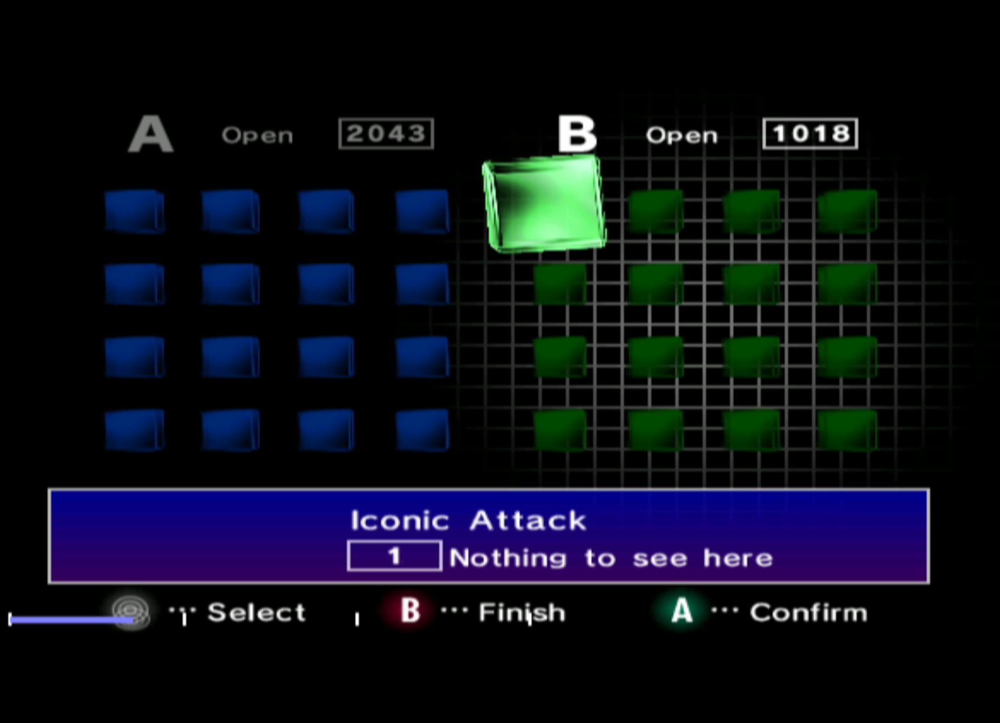

# Iconic Attack

 

Iconic is a potential exploit of the Gamecube's IPL, allowing for system takeover using a specially designed memory card.  The IPL's memory card icon handling code has an uninitialized default case, allowing icons of invalid texture type `3` to leave a read size variable uninitialized as discovered by @Sierraffinity.  After some digging, it appears this is unexploitable.  The project contains the raw memory card used to investigate the bahavior of the menu and shared in the hopes someone will find something I missed.

The raw memory card has 16K sectors and a malformed icon that should cause the icon read size to return 0x28CD800.  This gets sanity checked to its doom, and there seems to be no way to bypass the check as one would need to adjust the product of `file length` and `sector size` to exceed the uninitialized value in order to use it.  Unfortunately, the length scales *down* with increasing sector size, and the product remains the same.

If you're using dolphin, you'll need to patch `m_nintendo_card_id` to `0x00000880` in GCMemcardRaw.cpp

[Save File](Test2.USA.raw)
